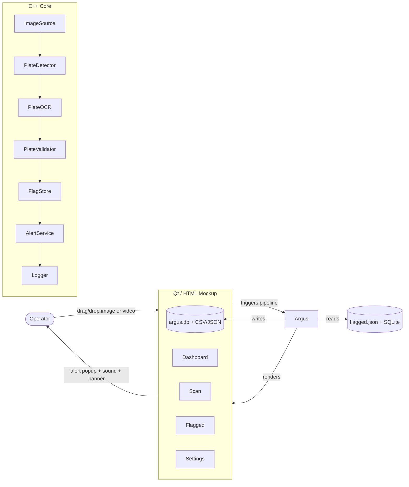
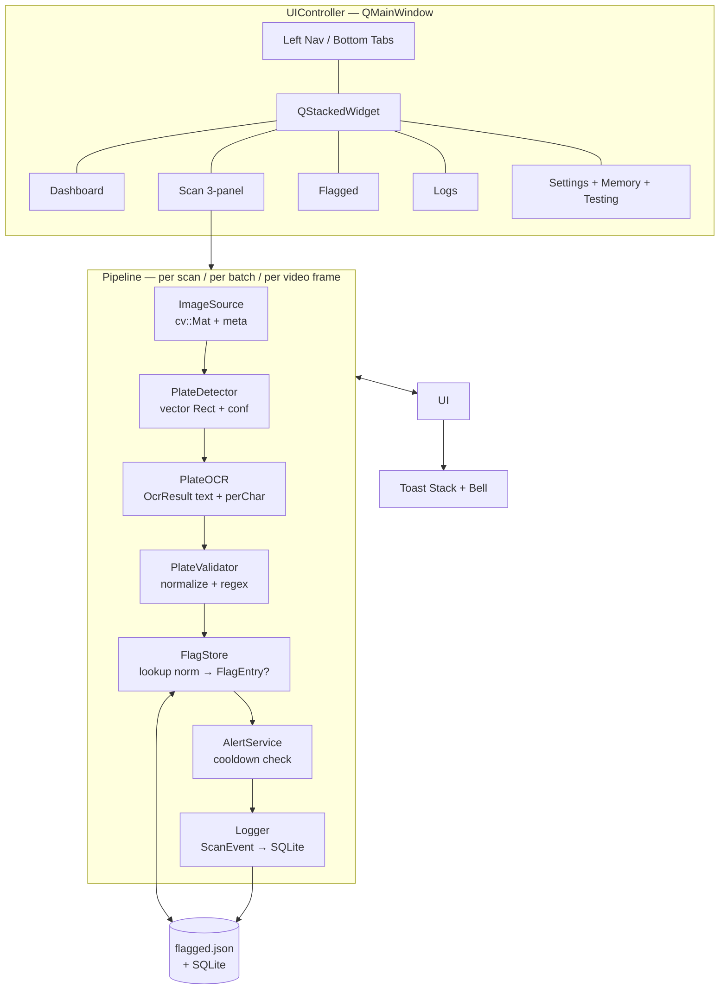
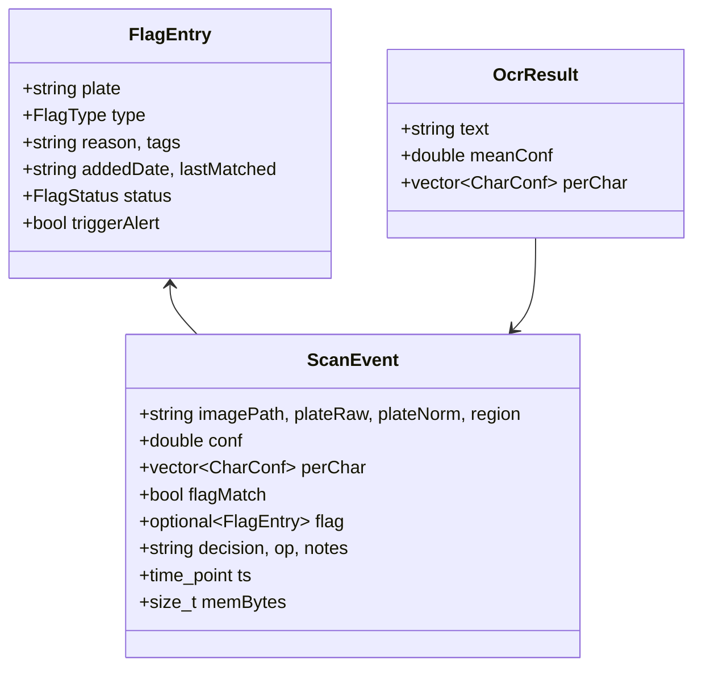
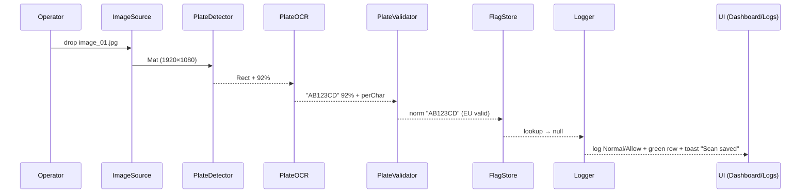
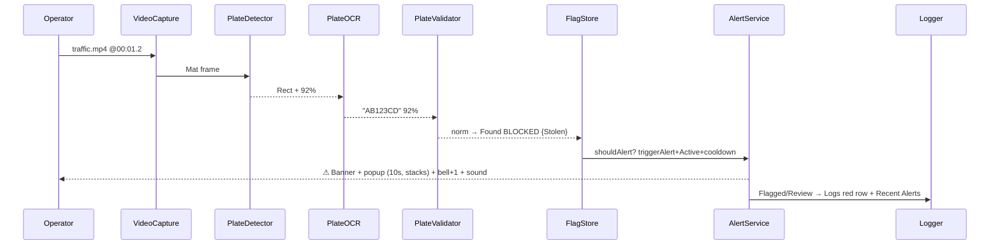
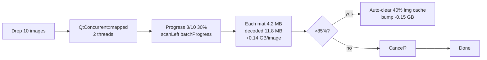
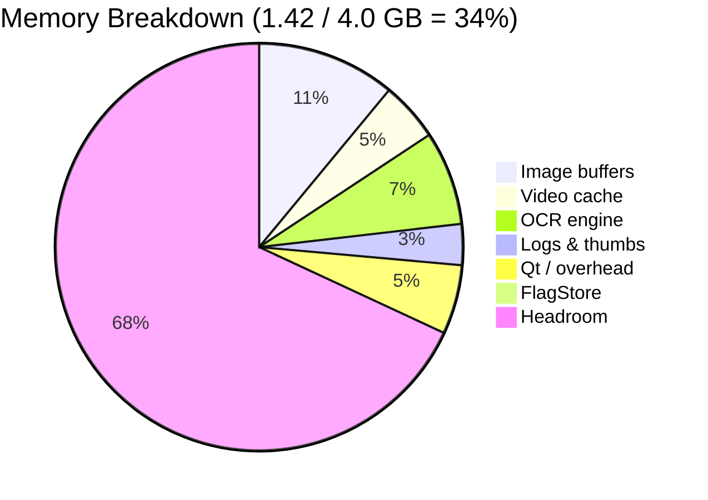
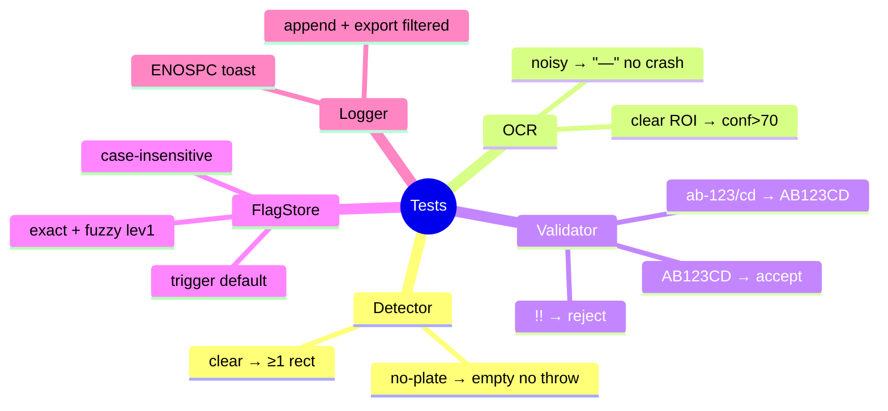
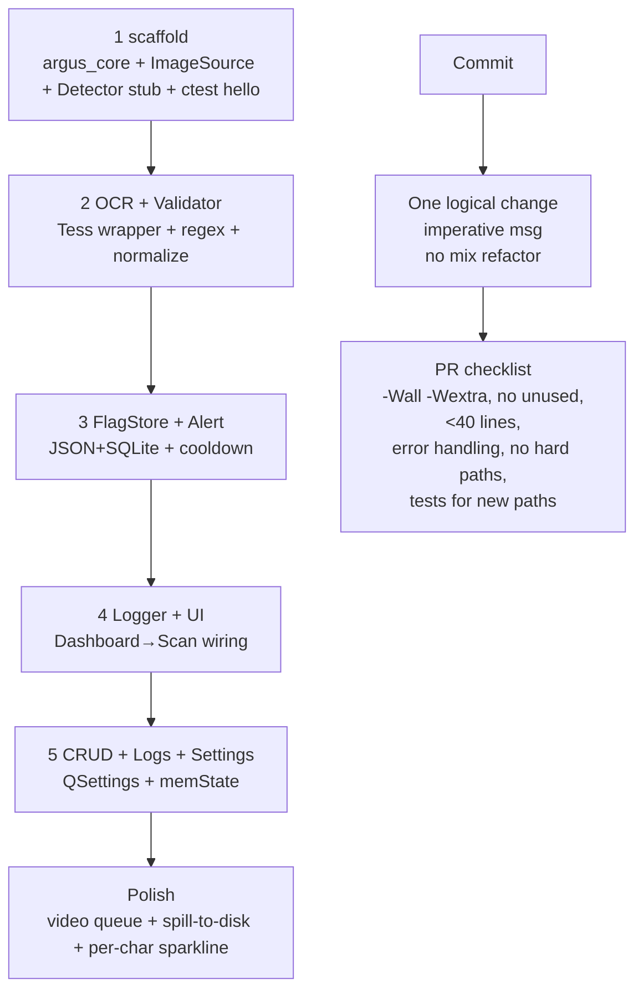

# Argus — License Plate Recognition & Flagging System

<p align="center">
  
  
  
  
  
</p>

<p align="center">
  <a href="https://nyght-x-walker.github.io/argus/"><b>▶ Live Mockup</b> — nyght-x-walker.github.io/argus</a> • Clean, testable desktop system for cybersecurity coursework
</p>

> **Not for production** — educational, offline-first, no face/person tracking. Mockup first to lock layout & flows before C++ backend.

---

## 1) At a Glance

| | |
|---|---|
| **Users** | Cybersecurity students · security operators (lab/demo) |
| **What it does** | Ingest **image / video frame** → detect plate → OCR → **normalize & validate** → check **flagged watchlist** (Blocked / Suspicious / Authorized) → **alert** if matched → **log** with decision & notes |
| **Inputs** | Drag & drop JPG/PNG/BMP/MP4 (50 MB, batch ≤10), camera frame |
| **Outputs** | Bounding box + plate text + confidence + per-char detail, flag badge, alert popup + sound, CSV/JSON export |

> **Try in mockup:** `Dashboard → drop traffic.mp4 → Scan → Process Frame → Save → Logs (red row + Recent Alerts)` or `Dashboard → Demo batch 10`.

---

## 2) Tech Stack

| Layer | Choice | Why |
|---|---|---|
| **Lang** | C++17 (gcc ≥9) | Course env, RAII, `std::optional`, smart pointers |
| **Vision** | OpenCV 4.8 `core/imgproc/imgcodecs/objdetect/videoio` | Plate ROI + `VideoCapture`, Linux-native |
| **OCR** | Tesseract 5.3 C++ API | Per-char confidence, EU/US/UK traineddata, offline |
| **UI** | Qt 6 Widgets | Single `QMainWindow` + `QStackedWidget` → 1:1 with HTML mockup `ui_mockup.html:1` |
| **Build** | CMake 3.16+ `target_*` | `argus_core` lib + `argus_app` + `argus_tests` |
| **Persist** | `resources/flagged.json` (atomic `tmp→rename→fsync`) + SQLite `argus.db` | Human-readable + queryable |
| **Mockup** | HTML/Tailwind + vanilla JS, GitHub Pages `master/index.html` | `https://nyght-x-walker.github.io/argus/` |

---

## 3) System Context



---

## 4) High-Level Architecture



**Project layout (target):**

```text
argus/
  include/  image_source.h  plate_detector.h  plate_ocr.h  plate_validator.h  flag_store.h  alert_service.h  logger.h
  src/      image_source.cpp ...  main.cpp
  resources/ flagged.json  test_images/{clear_01.jpg, angled_02.jpg, night_03.jpg, no_plate_04.jpg, noisy_06.jpg, video_clip_05.mp4}
  tests/    test_plate_detector.cpp  test_plate_validator.cpp  test_flag_store.cpp
  ui_mockup.html  index.html  ARCHITECTURE.md  CMakeLists.txt
```

> Conventions: `include/*.h` `#pragma once`, `namespace argus`, minimal includes; `src/*.cpp` functions **<40 lines** `CODE_STYLE.md:114`.

---

## 5) Components

| Component | API | Key Details |
|---|---|---|
| **ImageSource** | `std::optional<Mat> load(path/videoFrame)` + `{w,h,bytes,fps,frameIdx,ts}` | MIME + 50 MB guard, `filesystem::canonical` reject `..`, header sniff |
| **PlateDetector** | `vector<Rect> detect(Mat, vector<double>& confs)` | `gray → bilateral → Canny → findContours → aspect 2–5, area 0.5%–15% → NMS`. `constexpr MIN_PLATE_AREA_FRACTION=0.005`. Empty = expected |
| **PlateOCR** | `OcrResult{string text; double meanConf; vector<CharConf> perChar;}` | `TessBaseAPI`, `oem LSTM`, `psm SINGLE_LINE`, lang `eu/us/uk` from Settings |
| **PlateValidator** | `string normalize(raw)` / `bool isValid(norm)` / `Region` | `upper, trim, O→0, I→1, 5→S, '-' strip` + `EU ^[A-Z]{1,3}[0-9]{1,4}[A-Z]{0,2}$`. Live preview in badge + Flagged modal |
| **FlagStore** | `optional<FlagEntry> lookup(norm)` / `add/update/remove` / `save()` | `unordered_map<norm,FlagEntry>` + atomic `tmp→rename→fsync`. Fuzzy `lev≤1` only if `conf<85` |
| **AlertService** | `bool shouldAlert(entry, Settings)` | `triggerAlert && status==Active && cooldown(now-lastAlert>5min)` → `QSystemTrayIcon::showMessage` |
| **Logger** | `log(ScanEvent)` / `exportCsv(filter)` / `rotate()` | `logs{ts,imagePath,thumbPath,plateRaw,plateNorm,conf,perCharJson,flagMatch,flagType,region,decision,op,notes,mem}`. Graceful `ENOSPC → toast` |
| **UIController** | `QStackedWidget` + signal/slot | Maps 1:1 to mockup views; `QGraphicsView+RectItem` bbox green/red/yellow; `QSettings+config.json` |



---

## 6) Data Flow & Sequences

### Flow A — Normal image



### Flow C — Flagged video frame



### Batch & Video (performance)



**Error paths:** `corrupt.jpg → ImageSource throw → toast "libjpeg: bogus marker" + dropZone border-danger 2.6s` · `OCR fail → conf "—" / perChar "OCR failed" / validator ✗ invalid / forced Review + bbox hidden`.

---

## 7) Error Handling & Security

| Concern | Rule |
|---|---|
| **Exceptions** | file not found, invalid config, SQLite failure |
| **Optional** | no plate, low conf (`conf=="—"`), empty ROI |
| **Input** | `filesystem::canonical` reject `..`, MIME sniff, OCR `sanitize` + cap 128, no log of full images |
| **State** | No global mutable; DI `PlateDetector(cfg)`, `FlagStore(path)` |
| **Privacy** | `Settings.blur` → `cv::GaussianBlur` ROI only for `thumbs/` |

---

## 8) Memory Budget (live in mockup)



*Shown in 4 places:* header chip `MEM 1.4GB 34%` bar `29:1` → click scrolls to `memoryPanel` `96:1`; sidebar widget `42:1` `1.4/4GB peak 2.1GB`; Dashboard gauge `34% OK • headroom 2.6GB` + bars + 24-bar sparkline (5-min history); Scan bottom `Mem 342 MB` + right `MEMORY (THIS VIEW)` card. **Policy:** `Settings → Memory Management` limits `Max 3.20 GB / Image cache 512 MB / 24 frames`, `Auto-clear >85%` frees 40% img +70% vid, live drift `±0.02 GB/3.2s`, bumps `+0.14 GB/image, +0.38 GB/video`.

---

## 9) Build, Test, Run

```bash
cmake -B build -S . && cmake --build build -j   # -Wall -Wextra -Werror
./build/argus_app                                # Qt window
ctest --test-dir build --output-on-failure
```

| Target | What |
|---|---|
| `argus_core` | lib: detector + OCR + validator + store + logger |
| `argus_app` | `src/main.cpp` + Qt window |
| `argus_tests` | Catch2: `test_plate_detector`, `test_plate_validator`, `test_flag_store` |
| `resources/test_images/` | `clear_01.jpg` `angled_02.jpg` `night_03.jpg` `no_plate_04.jpg` `noisy_06.jpg` `video_clip_05.mp4` — deterministic, offline |

**Coverage target:** 92% critical paths (see Settings → Testing & Build accordion).

---

## 10) Testing Strategy



---

## 11) Workflow



*Docs:* `ARCHITECTURE.md` (this file) + `README.md` (build/run) + live mockup `https://nyght-x-walker.github.io/argus/`.

---

## 12) Roadmap

| Version | Focus |
|---|---|
| **v0.2** | `VideoCapture` double-buffered queue, spill-to-disk when cache > limit, per-char sparkline in Logs |
| **v0.3** | Roles Admin/Operator/Viewer (now placeholder), retention cron, blur pipeline benchmark |

---

<p align="center"><sub>Mockup first to lock layout/flows before C++ backend — this file is source of truth for boundaries & state.</sub></p>
