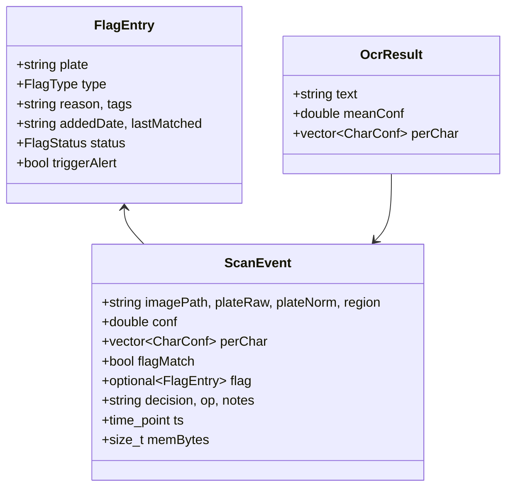
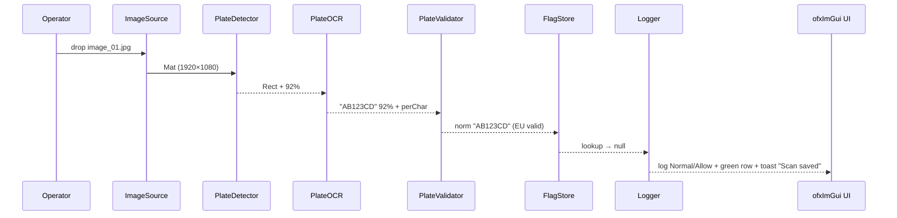
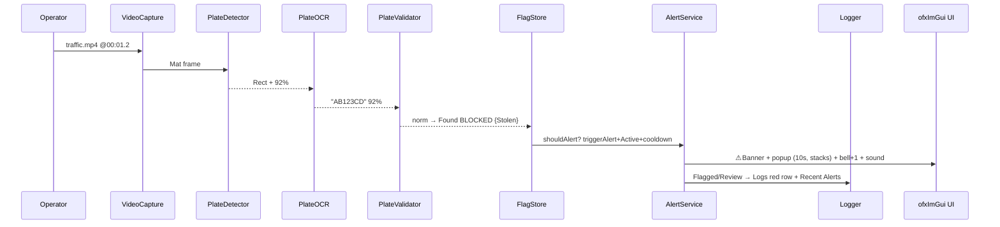
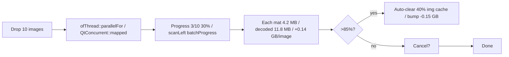
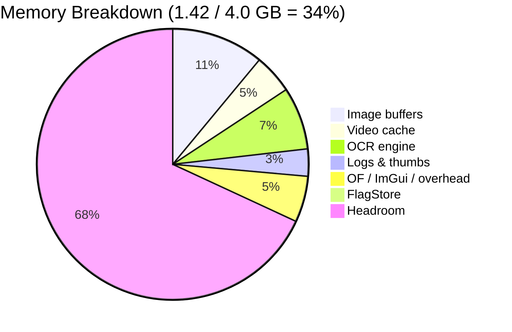
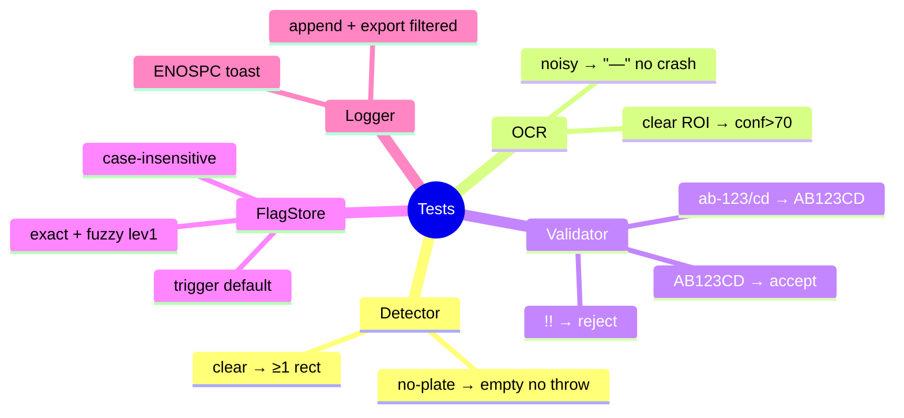
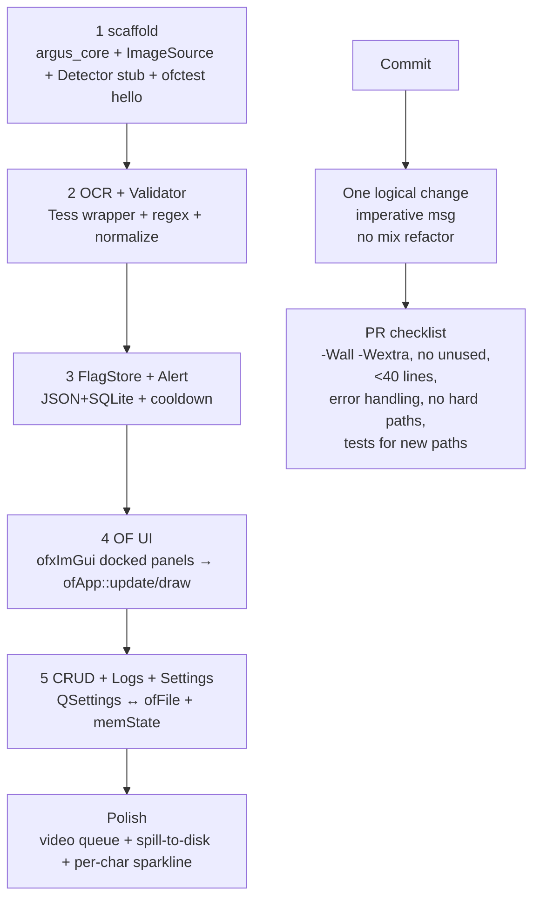

# Argus — openFrameworks Workflow Architecture

<p align="center">
  
  
  
  
</p>


</p>

> **Not for production** — educational, offline-first, no face/person tracking. Mockup first to lock layout & flows before C++ backend · ofApp single window, no page router.

---

## 1) At a Glance

| | |
|---|---|
| **Users** | Cybersecurity operators (lab/demo) |
| **What it does** | Ingest image / video frame → detect plate → OCR → normalize & validate → check flagged watchlist (Blocked / Suspicious / Authorized) → alert if matched → log with decision & notes |
| **Inputs** | Drag & drop JPG/PNG/BMP/MP4 (50 MB, batch ≤10), camera frame |
| **Outputs** | Bounding box + plate text + confidence + per-char detail, flag badge, alert popup + sound, CSV/JSON export |
| **Try in OF** | `ofApp::update()` pipeline → `ofApp::draw()` viewport → inspector panels · Run (R) → Batch 10 → Process Frame → Save → Logs (red row + Recent Alerts) |

---

## 2) Tech Stack

| Layer | Choice | Why |
|---|---|---|
| **Lang** | C++17 (gcc ≥9) | Course env, RAII, `std::optional`, smart pointers |
| **Framework** | openFrameworks 0.12+ | Creative-coding foundation, OF 0.12 core + addons |
| **UI** | `ofxImGui 1.89` | Immediate-mode GUI; docked windows replace `QStackedWidget` |
| **Vision** | OpenCV 4.8 `core/imgproc/imgcodecs/objdetect/videoio` | Plate ROI + `VideoCapture`, Linux-native — **shared with Qt** |
| **OCR** | Tesseract 5.3 C++ API | Per-char confidence, EU/US/UK traineddata, offline — **shared with Qt** |
| **Build** | CMake 3.16+ `target_*` | `ofxAddons` for `ofxImGui`; `argus_core` lib + `ofApp` executable |
| **Persist** | `resources/flagged.json` (atomic `tmp→rename→fsync`) + SQLite `argus.db` | Human-readable + queryable — **same as Qt** |
| **Mockup** | `of_mockup.html` — ofApp + ofxImGui adaptation | `/of_mockup.html` adapts mockup UI to OF ImGui; not HTML served |

---

## 3) System Context

```mermaid
flowchart LR
  Operator([Operator]) -- drag/drop image or video --> ofApp
  ofApp -- triggers pipeline --> ArgusCore
  ArgusCore -- reads --> FlaggedStore[(flagged.json + SQLite)]
  ArgusCore -- writes --> Logs[(argus.db + CSV/JSON)]
  ofApp -- renders --> GL Viewport · ofxImGui panels
  ofApp -- alert popup + sound + banner --> Operator

  subgraph ArgusCore[C++ Core]
    ImageSource --> PlateDetector --> PlateOCR --> PlateValidator --> FlagStore --> AlertService --> Logger
  end

  ofApp -- UIController (ofxImGui) --> |pipeline status, mem, flags|
```

---

## 4) High-Level Architecture

```mermaid
graph TD
  subgraph Window[ofApp — single window]
    Nav[Left Panel — tools + pipeline LEDs]
    View[Center — GL viewport · ofApp::draw()]
    Inspect[Right Panel — inspector · ofxImGui]
    Bot[Bottom Panel — console + tables + memory]
    Nav --- View --- Inspect --- Bot
  end

  subgraph Pipeline[Pipeline — per scan / per video frame]
    IS[ImageSource<br/>cv::Mat + meta]
    PD[PlateDetector<br/>vector Rect + conf]
    OCR[PlateOCR<br/>OcrResult text + perChar]
    PV[PlateValidator<br/>normalize + regex]
    FS[FlagStore<br/>lookup norm → FlagEntry?]
    AS[AlertService<br/>cooldown check]
    LG[Logger<br/>ScanEvent → SQLite]
    IS --> PD --> OCR --> PV --> FS --> AS --> LG
  end

  Pipeline --- ofApp::update()
  ofApp::draw() --> View
  Inspect --> |decision, notes, flags| ofApp::update()
```

**Project layout (target):**

```
argus/
  include/  image_source.h  plate_detector.h  plate_ocr.h  plate_validator.h  flag_store.h  alert_service.h  logger.h
  src/      image_source.cpp ...  ofApp.cpp  ofApp.h
  resources/ flagged.json  test_images/{clear_01.jpg, angled_02.jpg, night_03.jpg, no_plate_04.jpg, noisy_06.jpg, video_clip_05.mp4}
  addons/   ofxImGui  (submodule or git pull)
  tests/    test_plate_detector.cpp  test_plate_validator.cpp  test_flag_store.cpp
  of_mockup.html  ARCHITECTURE_OF.md  CMakeLists.txt
```

> Conventions: `include/*.h` `#pragma once`, `namespace argus`, minimal includes; `src/*.cpp` functions **<40 lines** `CODE_STYLE.md:114`.

---

## 5) Components

| Component | API | Key Details |
|---|---|---|
| **ImageSource** | `std::optional<Mat> load(path/videoFrame)` + `{w,h,bytes,fps,frameIdx,ts}` | MIME + 50 MB guard, `filesystem::canonical` reject `..`, header sniff — **same as Qt** |
| **PlateDetector** | `vector<Rect> detect(const Mat, vector<double>& confs)` | `gray → bilateral → Canny → findContours → aspect 2–5, area 0.5%–15% → NMS`. `constexpr MIN_PLATE_AREA_FRACTION=0.005`. Empty = expected — **same as Qt** |
| **PlateOCR** | `OcrResult{string text; double meanConf; vector<CharConf> perChar;}` | `TessBaseAPI`, `oem LSTM`, `psm SINGLE_LINE`, lang `eu/us/uk` from Settings — **same as Qt** |
| **PlateValidator** | `string normalize(raw)` / `bool isValid(norm)` / `Region` | `upper, trim, O→0, I→1, 5→S, '-' strip` + `EU ^[A-Z]{1,3}[0-9]{1,4}[A-Z]{0,2}$`. Live preview in badge + Flagged modal — **same API, OF widget preview** |
| **FlagStore** | `optional<FlagEntry> lookup(norm)` / `add/update/remove` / `save()` | `unordered_map<norm,FlagEntry>` + atomic `tmp→rename→fsync`. Fuzzy `lev≤1` only if `conf<85` — **same as Qt** |
| **AlertService** | `bool shouldAlert(entry, Settings)` | `triggerAlert && status==Active && cooldown(now-lastAlert>5min)` → `ofSystemAlert` + `ofSoundStream` + bell dot — **OF counterpart** |
| **Logger** | `log(ScanEvent)` / `exportCsv(filter)` / `rotate()` | `logs{ts,imagePath,thumbPath,plateRaw,plateNorm,conf,perCharJson,flagMatch,flagType,region,decision,op,notes,mem}`. Graceful `ENOSPC → toast` — **same as Qt** |
| **UIController** | `ofxImGui` docked panels | Left: pipeline LEDs + Run/Batch/Frame/OCR-fail/corrupt. Center: GL viewport + bbox + overlay. Right: inspector + decision + memory + flag editor. Bottom: console + flagged + logs + memory breakdown — **replaces `QStackedWidget`** |



---

## 6) Data Flow & Sequences

### Flow A — Normal image



### Flow C — Flagged video frame



### Batch & Video (performance)



**Error paths:** `corrupt.jpg → ImageSource throw → toast "libjpeg: bogus marker" + dropZone border-danger 2.6s` · `OCR fail → conf "—" / perChar "OCR failed" / validator ✗ invalid / forced Review + bbox hidden`.

---

## 7) Error Handling & Security

| Concern | Rule |
|---|---|
| **Exceptions** | file not found, invalid config, SQLite failure |
| **Optional** | no plate, low conf (`conf=="—"`), empty ROI |
| **Input** | `filesystem::canonical` reject `..`, MIME sniff, OCR `sanitize` + cap 128, no log of full images |
| **State** | No global mutable; DI `PlateDetector(cfg)`, `FlagStore(path)` |
| **Privacy** | `Settings.blur` → `cv::GaussianBlur` ROI only for `thumbs/` |
| **OF note** | ofNoThread unsafe for UI; all ofxImGui calls from `ofApp::draw()` main thread only |

---

## 8) Memory Budget (live in OF)



*Shown in 4 places:* header chip `MEM 1.4GB 34%` bar → click scrolls to `memoryPanel`; sidebar widget `1.4/4GB peak 2.1GB`; OF gauge `34% OK • headroom 2.6GB` + bars + 24-bar sparkline (5-min history); Scan bottom `Mem 342 MB` + right `MEMORY (THIS VIEW)` card. **Policy:** `Settings → Memory Management` limits `Max 3.20 GB / Image cache 512 MB / 24 frames`, `Auto-clear >85%` frees 40% img +70% vid, live drift `±0.02 GB/3.2s`, bumps `+IMG_MEM_BUMP GB/image, +VID_MEM_BUMP GB/video` where `constexpr double IMG_MEM_BUMP=0.14; constexpr double VID_MEM_BUMP=0.38;` (CODE_STYLE.md:114).

*OF note:* decoded `cv::Mat` held until `mat.release()` after OCR + on view switch. Video decoding uses double-buffered queue. ImGui plot lines replace Tailwind gauge.

---

## 9) Build, Test, Run

```bash
# OF setup (example)
cd argus
cmake -B build -S . -DOpenCV_DIR=/usr/local/opt/opencv/lib/cmake/opencv4
cd build
make -j                                # compiles ofApp + argus_core
./bin/ofApp                            # Qt-like window via OF + ofxImGui

ctest --test-dir build --output-on-failure
```

| Target | What |
|---|---|
| `argus_core` | lib: detector + OCR + validator + store + logger |
| `ofApp` | `src/ofApp.cpp` + ofxImGui window; CMake target `ofApp` per OF convention |
| `argus_tests` | Catch2: `test_plate_detector`, `test_plate_validator`, `test_flag_store` |
| `resources/test_images/` | `clear_01.jpg` `angled_02.jpg` `night_03.jpg` `no_plate_04.jpg` `noisy_06.jpg` `video_clip_05.mp4` — deterministic, offline |

**Coverage target:** 92% critical paths (see Settings → Testing & Build accordion).

---

## 10) Testing Strategy



- Tests must be: Deterministic (no random behavior without fixed seeds). Independent (no shared mutable state between tests). Fast (suitable for repeated runs).
- Use sample images stored in `resources/test_images/`.
- Document how to run tests in `README.md` (e.g., `cmake --build . --target test`).

### 10.1. Coverage Expectations

- Aim for meaningful coverage of: Core detection logic. OCR integration. Flag matching. Error paths (missing files, invalid images).
- 100% line coverage is not required, but critical paths must be covered.

---

## 11) Workflow



*Docs:* `ARCHITECTURE_OF.md` (this file) + `README.md` (build/run) + live mockup `of_mockup.html`.

---

## 12) Roadmap

| Version | Focus |
|---|---|
| **v0.2** | `ofApp` double-buffered queue, spill-to-disk when cache > limit, per-char sparkline in Logs |
| **v0.3** | Roles Admin/Operator/Viewer (now placeholder), retention cron, blur pipeline benchmark |

---

<p align="center"><sub>Mockup first to lock layout/flows before C++ backend — this file is source of truth for boundaries & state.</sub></p>